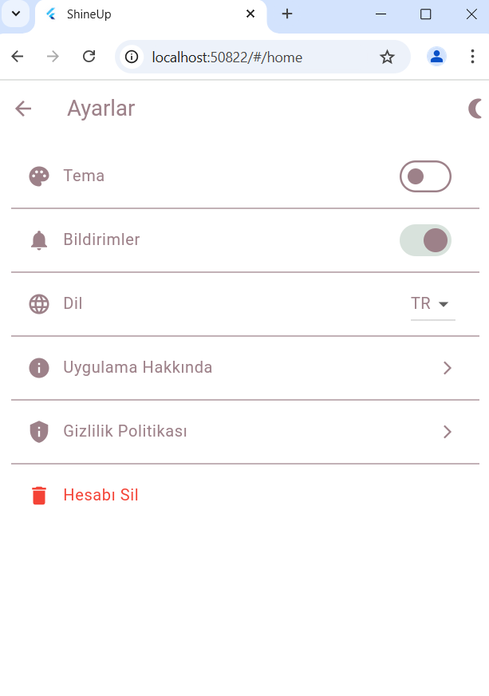
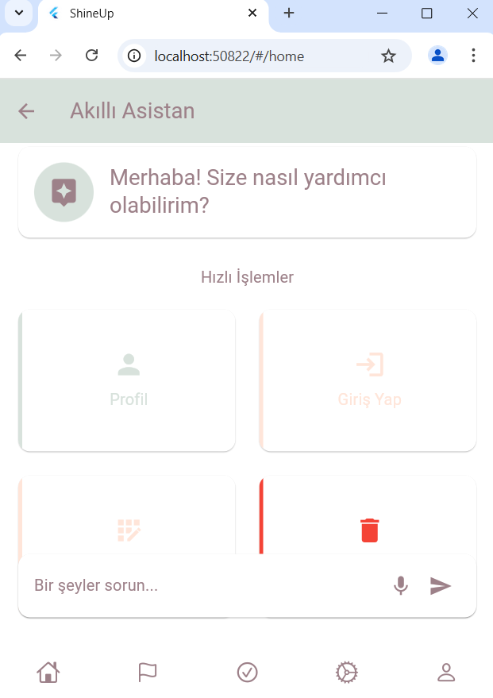

# Flutter Projesi

  


  

## Proje Hakkında

[ShineUp, kullanıcıların kişisel gelişim hedeflerini belirlemelerine, alışkanlıklarını takip etmelerine ve duygusal durumlarına göre hayatlarını organize etmelerine yardımcı olan bir uygulamadır. Kullanıcılar, günlük hedefler koyabilir, başarılarını izleyebilir ve hayal ettikleri yaşamı yaratmalarına destek olacak araçlarla motive olabilirler]

  

## Ekibimiz

-  **Danışman:**  

[https://github.com/keyvanarasteh] (Keyvan Arasteh)


-  **Takım Üyeleri:**

[https://github.com/nidanurkose] (Nida Nur Köse)


  

## Özellikler

- Kişisel Gelişim ve Hedef Takibi

- Alışkanlık Yönetimi

- Motivasyon ve İlham

- Kullanıcı Profili ve Kişiselleştirme

- Çoklu Dil Desteği

- Ayarlar ve Bildirimler

## Kullanılan Teknolojiler

- Flutter

- Dart

- [Diğer teknolojiler]

  

## Başlangıç

  

### Gereksinimler

- Flutter SDK (sürüm 3.3.0)

- Dart SDK (sürüm 2.17.0)

- [Visual Studio Code]

  

### Kurulum Adımları

1. Projeyi bilgisayarınıza indirin:

```bash

git  clone [https://github.com/nidanurkose/ShineUp-Flutter]

```

  

2. Proje klasörüne gidin:

```bash

cd [https://github.com/nidanurkose/ShineUp-Flutter]

```

  

3. Gerekli paketleri yükleyin:

```bash

flutter  pub  get

```

  

4. Uygulamayı başlatın:

```bash

flutter  run

```

  

## Proje Yapısı

lib/
├── ekranlar/            # Uygulamanın tüm ekranları
│   ├── login_screen.dart   # Giriş ekranı
│   ├── home_screen.dart    # Anasayfa ekranı
│   ├── goals_screen.dart   # Hedefler ekranı
│   ├── profile_screen.dart # Profil ekranı
│   ├── history_screen.dart # Geçmiş ekranı
│   └── settings_screen.dart # Ayarlar ekranı
│   ├── voice_screen.dart # Asistan ekranı
│   └── habits_screen.dart # Alışkanlıklar ekranı
│   ├── motivation_screen.dart # Geçmiş ekranı
│   └── loadings_screen.dart # Ayarlar ekranı
│
├── modeller/            # Veri modelleri
│   ├── user_model.dart     # Kullanıcı model
│   ├── goal_model.dart     # Hedef model
│   └── habit_model.dart    # Alışkanlık model
│
├── widgets/             # Tekrar kullanılabilir widget'lar
│   ├── bottom_menu.dart    
│   ├── logo.dart  
│   └── isuggested_action.dart   
│
├── servisler/           # API servisleri veya veri çekme işlemleri
│   ├── api.dart  
│
├── yardımcılar/         # Yardımcı fonksiyonlar
│   └── constants.dart      # Sabitler (örneğin renkler, boyutlar)
│
└── main.dart             # Uygulamanın başlangıç noktası


## Ekran Görüntüleri

### Yükleniyor


### Ana Sayfa


### Hedefler Sayfası


### Alışkanlıklar Sayfası

### Motivasyon Sayfası

### Geçmiş Sayfası

### Kayıt Ol Sayfası

### Profil Sayfası

### Ayarlar Sayfası

### Akıllı Asistan Sayfası


## Projeye Katkı Sağlama

1. Projeyi forklayın

2. Yeni bir dal oluşturun (`git checkout -b ozellik/YeniOzellik`)

3. Değişikliklerinizi kaydedin (`git commit -m 'Yeni özellik eklendi'`)

4. Dalınıza gönderin (`git push origin ozellik/YeniOzellik`)

5. Pull Request oluşturun

  

## Lisans

[Lisans türü] kapsamında lisanslanmıştır. Daha fazla bilgi için `LICENSE` dosyasını inceleyebilirsiniz.

  

## İletişim

- Proje Bağlantısı: [https://github.com/nidanurkose/ShineUp-Flutter]

- İstinye Üniversitesi: [https://www.istinye.edu.tr/](https://www.istinye.edu.tr/)

  

## Teşekkürler

- İstinye Üniversitesi'ne destekleri için teşekkür ederiz


  
  

